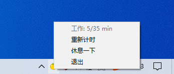

# 站起来休息一会吧

> Version 1.1.0

程序截图：



- 下载程序：[RandRest v1.1.0](https://github.com/Trisia/RandRest/releases/tag/v1.1.0)

## 工作原理

默认情况时钟程序将会开机自启动。

```
For Loop:
    时间：35min
    站立：5min
```

## 编译

使用脚本编译，切换目录到项目目录，打开CMD窗口运行

```cmd
buid.bat
```

程序存储于项目目录的`target` 目录内包括:

- 32位程序: `StandRest_386.exe`
- 64位程序: `StandRest.exe`

```
D:\Project\cliven\RandRest>buid.bat
[+] target\StandRest_386.exe
[+] target\StandRest.exe
```
